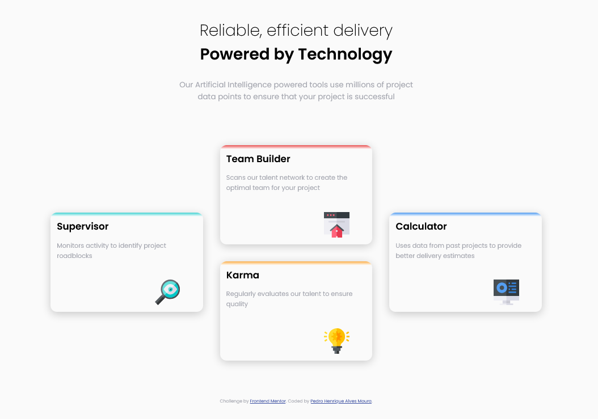
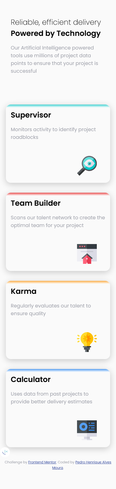

# Frontend Mentor - Four card feature section

This is a solution to the <a href="https://www.frontendmentor.io/challenges/four-card-feature-section-weK1eFYK" alt="Four card feature section">Four card feature section</a>  

*Frontend Mentor challenges help you improve your coding skills by building realistic projects.*

## Table of contents

- [Overview](#overview)
  - [The challenge](#the-challenge)
  - [Screenshots](#screenshots)
  - [Links](#links)
- [My process](#my-process)
  - [Built with](#built-with)
  - [What I learned](#what-i-learned)
  - [Continued development](#continued-development)
  - [Useful resources](#useful-resources)
- [Author](#author)

## Overview

### The challenge

Users should be able to:

- View the optimal layout for the component depending on their device's screen size

### Screenshots

  *OBS: THE IMAGES MAY NOT BE IN THE SAME SCALE.*

# MODEL - Frontend Mentor - Social proof section

  

  

# MY SOLUTION - Frontend Mentor - Social proof section

  

  

### Links

- Solution URL: [Add solution URL here](#)
- Live Site URL: [Add live site URL here](#)

## My process

### Built with

- Semantic HTML5 markup
- CSS Grid
- Mobile-first workflow

### What I learned

In this project I learned how to use the a grid inside another grid to display the cards properly and how to use the "linear-gradient" background to create the colors on the top in each card.  

### Continued development

I am not totally comfortable with CSS Grid and Media Queries yet, so I am going to continue focusing on it in future projects.

### Useful resources

- <a href="https://www.w3schools.com/css/css_positioning.asp" target="_blank" alt="Link to CSS Layout - The position Property">CSS Layout - The position Property</a>
- <a href="https://www.w3schools.com/css/css3_gradients.asp" target="_blank" alt="Link to CSS Gradients">CSS Gradients</a>
- <a href="https://www.w3schools.com/cssref/css3_pr_box-shadow.asp" target="_blank" alt="Link to CSS box-shadow Property">CSS box-shadow Property</a>

## Author

- Frontend Mentor - [@Pedrohamoura-Git](https://www.frontendmentor.io/profile/Pedrohamoura-Git)
- Instagram - [@ph_pedrohenrique21](https://www.instagram.com/ph_pedrohenrique21/)
