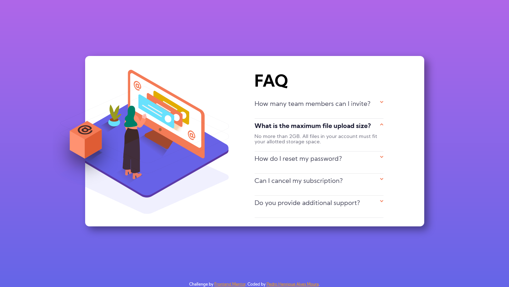
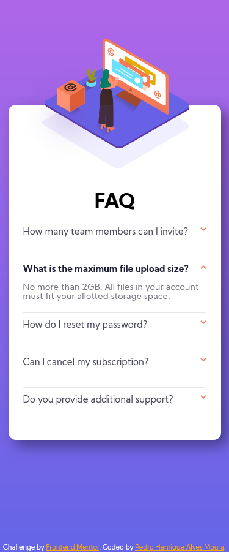

# Frontend Mentor - FAQ accordion card

This is a solution to the <a href="https://www.frontendmentor.io/challenges/faq-accordion-card-XlyjD0Oam" alt="FAQ accordion card
">FAQ accordion card</a>  

*Frontend Mentor challenges help you improve your coding skills by building realistic projects.*

## Table of contents

- [Overview](#overview)
  - [The challenge](#the-challenge)
  - [Screenshots](#screenshots)
  - [Links](#links)
- [My process](#my-process)
  - [Built with](#built-with)
  - [What I learned](#what-i-learned)
  - [Continued development](#continued-development)
  - [Useful resources](#useful-resources)
- [Author](#author)

## Overview

### The challenge

Users should be able to:

- (V) View the optimal layout for the component depending on their device's screen size
- (V) See hover states for all interactive elements on the page
- (V) Hide/Show the answer to a question when the question is clicked
- (V) Bonus: Complete the challenge without using JavaScript

### Screenshots

  *OBS: THE IMAGES MAY NOT BE IN THE SAME SCALE.*

# MODEL - Frontend Mentor - FAQ accordion card

  

  

# MY SOLUTION - Frontend Mentor - FAQ accordion card

  

  

### Links

- Solution URL: [Add solution URL here](#)
- Live Site URL: [Add live site URL here](#)

## My process

### Built with

- Semantic HTML5 markup
- CSS custom properties
- Flexbox
- CSS Grid
- Mobile-first workflow

### What I learned

It was a really good challenge to test my skill in CSS. I had to do some research to learn a little bit more about transitions, different types of selectors and the SVG type of image.
### Continued development

There is a lot of things that I don't know about animations yet, so I'm going to find new challenges to practice it.

### Useful resources

- <a href="https://stackoverflow.com/questions/23683136/html-css-hide-checkbox/23683190" target="_blank" alt="Link to HTML / CSS hide checkbox">HTML / CSS hide checkbox</a>
- <a href="https://www.w3schools.com/css/css3_transitions.asp" target="_blank" alt="CSS Transitions">CSS Transitions</a>
- <a href="https://www.w3schools.com/cssref/css_selectors.asp" target="_blank" alt="Link to CSS Selector Reference">CSS Selector Reference</a>

## Author

- Frontend Mentor - [@Pedrohamoura-Git](https://www.frontendmentor.io/profile/Pedrohamoura-Git)
- Instagram - [@ph_pedrohenrique21](https://www.instagram.com/ph_pedrohenrique21/)
