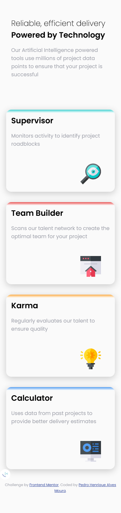

# Frontend Mentor - Four card feature section

This is a solution to the 

<a href="https://www.frontendmentor.io/challenges/four-card-feature-section-weK1eFYK" alt="Stats preview card component challenge on Frontend Mentor">Four card feature section</a>  

*Frontend Mentor challenges help you improve your coding skills by building realistic projects.*

## Table of contents

- [Overview](#overview)
  - [The challenge](#the-challenge)
  - [Screenshots](#screenshots)
  - [Links](#links)
- [My process](#my-process)
  - [Built with](#built-with)
  - [What I learned](#what-i-learned)
  - [Continued development](#continued-development)
  - [Useful resources](#useful-resources)
- [Author](#author)

## Overview

### The challenge

Users should be able to:

- View the optimal layout for the component depending on their device's screen size
- See a hover state on desktop for the Sign Up call-to-action

### Screenshots

  *OBS: THE IMAGES ARE NOT IN THE SAME SCALE.*

# Frontend Mentor - Social proof section MODEL

  

  

# Frontend Mentor - Social proof section MY SOLUTION

  

  

### Links

- Solution URL: [Add solution URL here](#)
- Live Site URL: [Add live site URL here](#)

## My process

### Built with

- Semantic HTML5 markup
- CSS Grid
- Mobile-first workflow

### What I learned

In this project I learned how to use the grid property "auto-fit" that automatically adjusts the responsiveness of the site according to the defined "min" and "max" parameters. I also learned to use the "span" in a container to extend it by multiple columns. Lastly, I learned how to use the "box-shadow" property to create the depth effect in the main container.

### Continued development

I am not totally comfortable with CSS Grid and Media Queries yet, so I am going to continue focusing on it in future projects.

### Useful resources

- <a href="https://developer.mozilla.org/en-US/docs/Web/CSS/grid-auto-columns" target="_blank" alt="Link to Grid auto columns">Grid auto columns</a>
- <a href="https://developer.mozilla.org/en-US/docs/Web/CSS/grid-column" target="_blank" alt="Link to Grid span columns and rows">Grid span columns and rows</a>
- <a href="https://www.w3schools.com/cssref/css3_pr_box-shadow.asp" target="_blank" alt="Link to CSS box-shadow Property">CSS box-shadow Property</a>

## Author

- Frontend Mentor - [@Pedrohamoura-Git](https://www.frontendmentor.io/profile/Pedrohamoura-Git)
- Instagram - [@ph_pedrohenrique21](https://www.instagram.com/ph_pedrohenrique21/)
